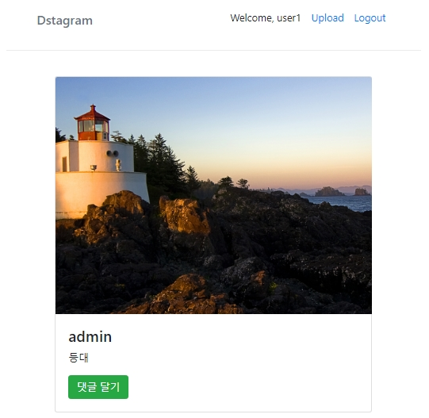

# Django practice 2 - Dstagram

### 결과물

- URL : https://django-dstagram.herokuapp.com
- 기능
  - 이미지 업로드, 수정, 삭제
  - 로그인, 로그아웃, 회원가입
  - 소셜 로그인 (네이버)
  - 댓글 달기
  - 태그 검색

----

----

### Tech

- Web framework : Django (Python), Bootstrap
- 플랫폼 : 네아로, Disqus
- 인프라 : Heroku, Postgres, AWS S3

### Reference

- (원본) https://github.com/flashmaestro/dstagram7
- Django : https://www.djangoproject.com/
- Bootstrap : https://getbootstrap.com/
- Heroku : https://www.heroku.com/
- Naver Dev Center : https://developers.naver.com/
- Disqus : https://disqus.com/
